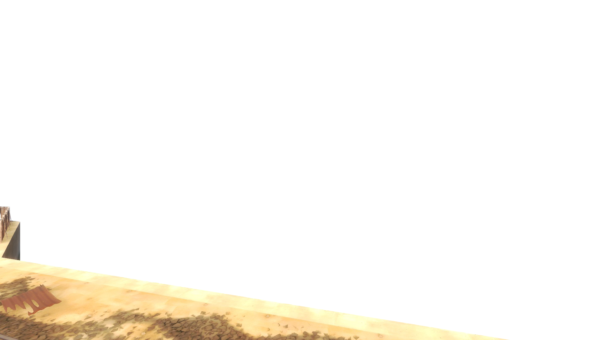
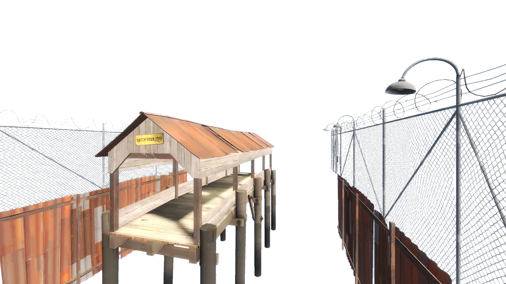
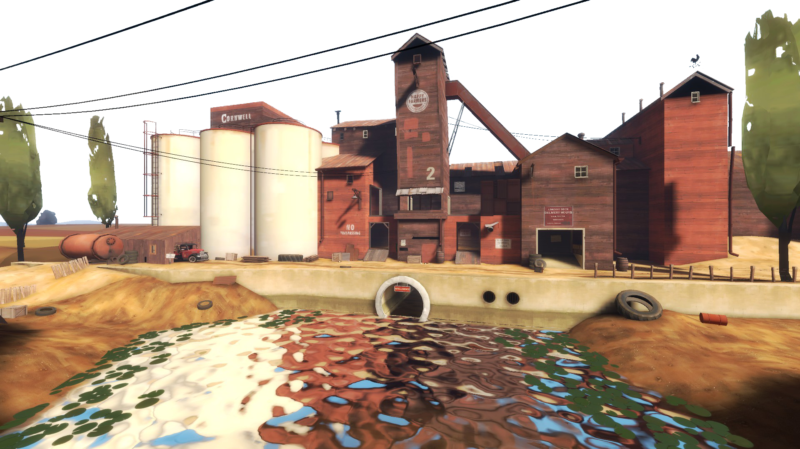

# teufort_parrallaxd

Current version :
Beta 1.1.3

A future project where i'll parallax the landmarks of teufort from the 2007 hit multiplayer game Team Fortress 2.
Parrallaxd parallaxes with the mouse or with a phone gyroscope. This way all users can experience the true parallax experience.

Documentation page about how to import the effect of the parrallaxd to your own website coming soon.

website of project : https://teufortparrallaxd.netlify.app/

Trello page for future plans : https://trello.com/b/Q2atXAgd/teufortparrallaxd

I am currently (2023 / 06 / 06) a little busy but I, one day, will work on this again.

Made for SAE 4.02, MMI Angoulême.

# "I wanna use it"

I do NOT recommand right now. I will take my time making it adaptable for you, and my code requires optimization.
If you think you can do a better job, do it, if you think you can't, then wait for a better option.
There might be a better option already.

That being said, I will still include the code to get it up and running :

Code to add to your HTML

    <section id="parrallaxd" class="fullContainer standBy">
        

        

          
        

        

          
        

        

          
        

      </section>

The Js script you'll need is :

    https://raw.githubusercontent.com/AlexEatDonut/teufort_parrallaxd/main/assets/script/parrallaxd.js
